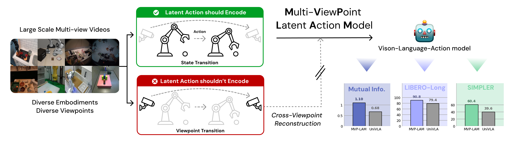
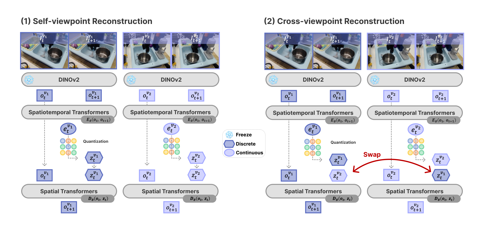

# MVP-LAM: Learning Action-Centric Latent Action via Cross-Viewpoint Reconstruction

[](https://arxiv.org/abs/2602.03668)
[](https://jmsnu.github.io/)
[](LICENSE)

**Jung Min Lee**<sup>1</sup>, **Dohyeok Lee**<sup>1</sup>, **Seokhun Ju**<sup>1</sup>, **Taehyun Cho**<sup>1</sup>, **Jin Woo Koo**<sup>1</sup>, **Li Zhao**<sup>2</sup>, **Sangwoo Hong**<sup>3</sup>, **Jungwoo Lee**<sup>1,4</sup>

<sup>1</sup>Seoul National University  <sup>2</sup>Microsoft Research Asia  <sup>3</sup>Konkuk University  <sup>4</sup>HodooAI Labs



<!-- **Cross-viewpoint reconstruction trains a latent action inferred from one view to explain the future in another view.** -->

</div>


### 💡 Highlights

- **Cross-viewpoint reconstruction** — a latent action inferred from one view must explain the future in another view, reducing reliance on viewpoint-specific cues.
- **Action-centric latent actions** — higher mutual information with ground-truth actions and improved action prediction, including under out-of-distribution evaluation.
- **Improved VLA pretraining** — pretraining VLAs with MVP-LAM latent actions improves downstream manipulation on the SIMPLER and LIBERO-Long benchmarks.


## 📢 News

- **[2026/06]** Code release of MVP-LAM. Please check it out!

## 🤗 Model Zoo

| Model | Backbone | HF Path | Note |
| --- | --- | --- | --- |
| mvp-lam | — | [mvp-lam](https://huggingface.co/JM-Lee/mvp-lam) | Multi-viewpoint LAM trained on OXE + EgoExo4D. |
| mvp-lam-7b | [prism-dinosiglip-224px+7b](https://huggingface.co/TRI-ML/prismatic-vlms/tree/main/prism-dinosiglip-224px%2B7b) | [mvp-lam-7b-bridge-pt](https://huggingface.co/JM-Lee/mvp-lam-7b-bridge-pt) | VLA pretrained on Bridge V2 with MVP-LAM latent actions. |
| mvp-lam-libero | [mvp-lam-7b](https://huggingface.co/JM-Lee/mvp-lam-7b-bridge-pt) | [mvp-lam-7b-224-libero](https://huggingface.co/JM-Lee/mvp-lam-7b-224-libero) | Finetuned on the LIBERO-Long. |
| mvp-lam-simpler | [mvp-lam-7b](https://huggingface.co/JM-Lee/mvp-lam-7b-bridge-pt) | [mvp-lam-7b-224-simpler](https://huggingface.co/JM-Lee/mvp-lam-7b-224-simpler) | Finetuned on small SIMPLER demos for SimplerEnv. |


## 🎮 Getting Started

1. (Optional) Create a conda environment.

```bash
conda create -n mvplam python=3.10 -y
conda activate mvplam
```

2. Install dependencies.

```bash
# Install PyTorch (our experiments use torch 2.2.0 + CUDA 12.1)
# See https://pytorch.org/get-started/previous-versions/ for other versions
pip install torch torchvision

# Clone and install
git clone https://github.com/jmsnu/mvp_lam.git
cd mvp_lam
pip install -e .

# Flash Attention 2 (required for training)
pip install packaging ninja
ninja --version; echo $?  # should return exit code "0"
pip install "flash-attn==2.5.5" --no-build-isolation
```

---

## 🔥 Training Recipe

### 0️⃣ Data Preparation

<details>
<summary><b>Open X-Embodiments</b></summary>

Please refer to [this script](https://github.com/moojink/rlds_dataset_mod/blob/ad83e6c0efad5823540c0f6d3a05529596ead0b5/prepare_open_x.sh) for an example of how to download datasets from OXE.

> **Note:** We filter out trajectories in Bridge V2 that contain only single-view images (approximately 50% of trajectories).

</details>

<details>
<summary><b>Ego-Exo4D</b></summary>

```bash
conda env create -f vla-scripts/extern/egoexo4d_build/environment_ubuntu.yml
conda activate rlds_env
```

```bash
pip install awscli ego4d
aws configure
egoexo -o /path/to/egoexo4d/ --parts annotations metadata downscaled_takes/448
```

```bash
cd vla-scripts/extern/egoexo4d_build
```

Preparing `info_clips.json`:

```bash
python prepare_dataset.py --root /path/to/egoexo4d
```

Converting to `.npy`:

```bash
python preprocess_egoexo4d.py \
    --denseclips_dir /path/to/egoexo4d/clips_jpgs/processed \
    --info_clips_json /path/to/egoexo4d/clips_jpgs/processed/info_clips.json \
    --source_videos_dir /path/to/egoexo4d/takes \
    --processes 32
```

```bash
python create_episode_egoexo4d.py \
    --source_dir /path/to/egoexo4d/clips_jpgs/processed \
    --target_dir /path/to/egoexo4d/data/train \
    --annotation_file /path/to/egoexo4d/clips_jpgs/processed/annotations.json \
    --verify --processes 8
```

```bash
bash tfds_build.sh
```

</details>

### 1️⃣ Latent Action Model Training

MVP-LAM learns discrete latent actions with a cross-viewpoint reconstruction objective. Self-viewpoint reconstruction predicts $o_{t+1}^{v}$ from $(o_t^{v}, z_t^{v})$, while cross-viewpoint reconstruction swaps latent actions across synchronized views and predicts $o_{t+1}^{v}$ from $(o_t^{v}, z_t^{\tilde v})$ for $v \neq \tilde v$.

<div align="center">



</div>

```bash
cd latent_action_model
torchrun --standalone --nnodes 1 --nproc-per-node 4 main.py fit \
    --config config/lam.yaml \
    2>&1 | tee lam.log
```

### 2️⃣ VLA Pretraining

The trained latent action model generates pseudo-labels for VLA pretraining via a next-token prediction objective. Latent action indices in the VQ-VAE codebook are mapped to dedicated tokens in the LLaMA tokenizer.

```bash
cd vla-scripts

GPUS_PER_NODE=4
NNODES=1
MASTER_PORT=${MASTER_PORT:-28596}
MASTER_ADDR=${MASTER_ADDR:-"127.0.0.1"}
RANK=${RANK:-0}

torchrun --nproc_per_node ${GPUS_PER_NODE} --nnodes ${NNODES} --node_rank ${RANK} \
    --master_addr ${MASTER_ADDR} --master_port ${MASTER_PORT} train.py \
    --vla.type prism-dinosiglip-224px+mx-bridge \
    --run_root_dir "vla_log"
```

Or simply run `bash ./vla-scripts/train.sh`.

### 3️⃣ Finetuning & Evaluation

With the pretrained generalist policy, we add embodiment-specific action decoder heads for downstream deployment.

<details>
<summary><b>LIBERO</b></summary>

> Please first download the [LIBERO datasets](https://huggingface.co/datasets/openvla/modified_libero_rlds/tree/main).

**Training:**

1. Set `vla_path` and `lam_path` in [training config](vla-scripts/finetune_libero.py).
2. Set your local LIBERO dataset path in `data_root_dir`.
3. Start training:

```bash
torchrun --standalone --nnodes 1 --nproc-per-node 2 finetune_libero.py \
    --dataset_name "libero_10_no_noops" \
    --run_root_dir "/path/to/run_dir"
```

**Evaluation:**

```bash
pip install -r experiments/robot/libero/libero_requirements.txt

python experiments/robot/libero/run_libero_eval.py \
    --task_suite_name libero_10 \
    --action_decoder_path /path/to/your/action_decoder_path.pt \
    --pretrained_checkpoint /path/to/your/libero_finetuned_model \
    --num_trials_per_task 50 \
    --seed 7
```

</details>

<details>
<summary><b>SimplerEnv</b></summary>

> Based on the [official SimplerEnv repo (maniskill3 branch)](https://github.com/simpler-env/SimplerEnv/tree/maniskill3).

1. Clone and install:

```bash
git clone -b maniskill3 https://github.com/simpler-env/SimplerEnv.git
cd SimplerEnv
pip install --upgrade git+https://github.com/haosulab/ManiSkill.git
pip install -e .
```

2. Add `experiments/robot/simpler-bridge/policies/univla` to `simpler_env/policies`, and replace `simpler_env/real2sim_eval_maniskill3.py` with `experiments/robot/simpler-bridge/real2sim_eval_maniskill3.py`.

3. Run evaluation:

```bash
# See experiments/robot/simpler-bridge/eval_simpler_bridge_4task.sh for all tasks
python real2sim_eval_maniskill3.py \
    --model="univla" \
    -e "PutSpoonOnTableClothInScene-v1" \
    -s 0 --num-episodes 24 --num-envs 1 \
    --action_decoder_path /path/to/your/action_decoder.pt \
    --ckpt_path /path/to/your/finetuned_model
```

</details>

---

## 🚀 Performance

### SIMPLER Benchmark

| Task | MVP-LAM | UniVLA | LAPA | OpenVLA | Octo-Small | Octo-Base | π₀ |
| :--- | :---: | :---: | :---: | :---: | :---: | :---: | :---: |
| StackG2Y | 33.3 | 16.7 | **54.2** | 41.6 | 8.3 | 0.0 | <u>37.5</u> |
| Carrot2Plate | **66.7** | 20.8 | <u>45.8</u> | 50.0 | 33.3 | 37.5 | 33.3 |
| Spoon2Towel | <u>66.7</u> | 54.2 | **70.8** | 37.5 | 25.0 | 12.5 | 29.2 |
| Eggplant2Bask | **75.0** | <u>66.7</u> | 58.3 | 16.7 | 12.5 | 20.8 | 45.8 |
| **AVG** | **60.4** | 39.6 | <u>57.3</u> | 36.4 | 19.8 | 17.7 | 36.5 |

### LIBERO-Long

| MVP-LAM | UniVLA (Bridge) | OpenVLA | π₀ | UniVLA (OXE) |
| :---: | :---: | :---: | :---: | :---: |
| **90.8** | 79.4 | 53.7 | 85.2 | 92.0 |

---

## 📝 Citation

If you find our code or models useful in your work, please cite our paper:

```bibtex
@misc{lee2026mvplam,
  title     = {MVP-LAM: Learning Action-Centric Latent Action via Cross-Viewpoint Reconstruction},
  author    = {Jung Min Lee and Dohyeok Lee and Seokhun Ju and Taehyun Cho and Jin Woo Koo and Li Zhao and Sangwoo Hong and Jungwoo Lee},
  year      = {2026},
  eprint    = {2602.03668},
  archivePrefix = {arXiv},
  primaryClass  = {cs.RO},
  url       = {https://arxiv.org/abs/2602.03668}
}
```

## Acknowledgements

We thank [UniVLA](https://github.com/OpenDriveLab/UniVLA) and [OpenVLA](https://github.com/openvla/openvla) for their open-sourced work!